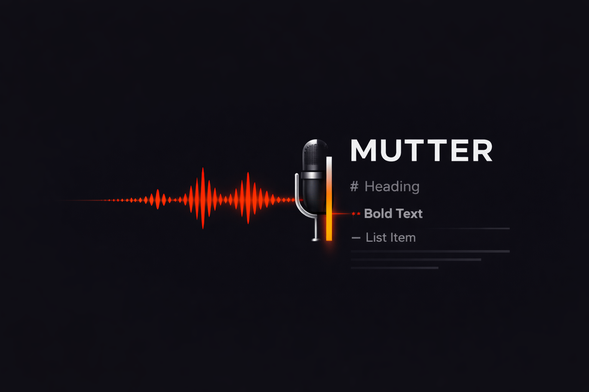

# Mutter: Voice-First Markdown



Most markdown editors expect your hands to be on the keyboard 100% of the time. **Mutter** is an experiment in writing and formatting notes using your voice, without sacrificing privacy or dealing with the lag of cloud-based STT.

It’s built with a Rust backend (Tauri) to keep things fast and runs Whisper models locally, so your voice data never leaves your machine.

---

## Why Mutter?

I built this because I found myself constantly breaking my flow to toggle formatting or fix lists. Mutter treats voice as a first-class citizen, not just an accessibility afterthought.

* **Actually Private:** No telemetry. No cloud APIs. It uses Hugging Face's `candle` crate to run inference on your CPU/GPU locally.
* **Context-Aware:** You don't have to be a robot. It uses BERT embeddings to understand that "Make this a title" and "Turn this into a heading" mean the same thing.
* **Robust State:** Your notes are plain Markdown files, but we use Automerge (CRDTs) under the hood to make sure you never lose a character, even if you’re jumping between devices or instances.

## What it looks like in practice

* **Live Preview:** Powered by CodeMirror 6. The syntax (like `**` or `#`) fades away when you aren't editing that specific line, keeping the interface clean (inspired by Dieter Rams' principles).
* **The Command Router:** Instead of just transcribing text, Mutter listens for commands. You can say "Delete that" or "Bold the last sentence" and it just works.
* **Agent-Tracker:** If you use [Agent-Tracker](https://github.com/forever-tools/agent-tracker), you can create tasks directly from your notes via voice.

---

## Getting Started

### Prerequisites

* **Node.js** (v18+) and **pnpm**
* **Rust** (Stable)
* **Linux users:** You'll need `libwebkit2gtk-4.1-dev`, `libgtk-3-dev`, and `libasound2-dev` for the audio engine.

### Setup

```bash
git clone https://github.com/yourusername/mutter.git
cd mutter
pnpm install
pnpm tauri:dev

```

**Note on first run:** The app will ask to download a Whisper model. I recommend **Distil-Whisper Medium**—it’s the best balance of speed and accuracy for most setups.

---

## Talk to your editor

| If you say... | Mutter will... |
| --- | --- |
| "Make this bold" | Wrap the selection in `**` |
| "Heading one" | Add a `#` to the start of the line |
| "Create a list" | Insert a `- ` bullet point |
| "Undo that" | Trigger a standard editor undo |
| "Task: Fix the CSS bug" | Send a new task to Agent-Tracker |

---

## The Tech Stack

* **The Engine:** Rust + Tauri v2 + Tokio for the heavy lifting.
* **The ML:** Candle 0.8 (Pure Rust ML framework) for local inference.
* **The UI:** React 19, TypeScript, and Tailwind v4.
* **The Editor:** CodeMirror 6 with a custom "distraction-free" configuration.

## License

MIT. Go wild.
